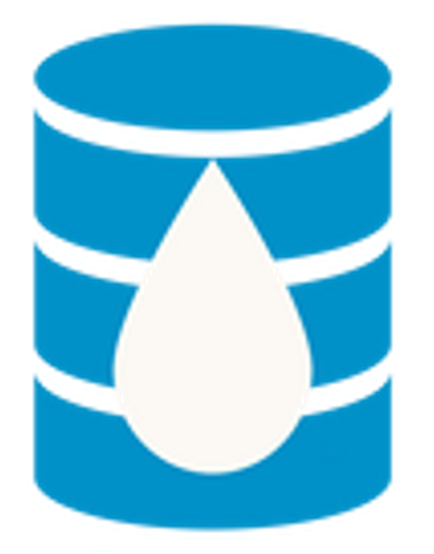

#  hf_hydrodata 

The ``hf_hydrodata`` Python package is a product of the [HydroFrame project](https://hydroframe.org) and is designed to provide easy access to national hydrologic simulations generated using the National ParFlow model ([ParFlow-CONUS1](https://hydroframe.org/parflow-conus1) and [ParFlow-CONUS2](https://hydroframe.org/parflow-conus2)) as well as a variety of other gridded model 
input datasets and point observations. Some of the datasets provided here are direct observations 
(e.g. USGS streamflow observations) while other are model outputs (e.g. ParFlow-CONUS2) or data products 
(e.g. remote sensing products). 

## Installation

The best way to install `hf_hydrodata` is using pip. This installs our 
latest stable release with fully-supported features:

    pip install hf_hydrodata

Users must create a HydroFrame API account and register their PIN before using the `hf_hydrodata` package. Please see [Creating a HydroFrame API Account](https://hf-hydrodata.readthedocs.io/en/latest/getting_started.html#creating-a-hydroframe-api-account) for detailed instructions.

## Documentation

You can view the full package documentation on [Read the Docs](https://hf-hydrodata.readthedocs.io).
Please see our [Python API Reference](https://hf-hydrodata.readthedocs.io/en/latest/api_reference.html) for detail on each core
method.

## Usage

You can use `hf_hydrodata` to get access to both gridded and point observation data from various
datasets.

You can view the available datasets and variables from [the documentation](https://hf-hydrodata.readthedocs.io)
or you can get the list of dataset and variables from functions.

    import hf_hydrodata as hf

    datasets = hf.get_datasets()
    variables = hf.get_variables({"dataset": "NLDAS2", "grid": "conus1"})

You can get gridded data using the `get_gridded_data()` function.

    import hf_hydrodata as hf

    options = {
      "dataset": "NLDAS2", "variable": "precipitation", "period": "hourly",
      "start_time": "2005-10-1", "end_time": "2005-10-2", "grid_bounds": [100, 100, 200, 200]
    }
    data = hf.get_gridded_data(options)

``hf_hydrodata`` supports access to a collection of site-level data from a variety of sources using the `get_point_data()` function. 

The below syntax will return daily USGS streamflow data from January 1, 2022 through January 5, 2022 
for sites that are within the bounding box with latitude bounds of (45, 50) and longitude bounds
of (-75, -50).

    from hf_hydrodata import get_point_data, get_point_metadata

    data_df = get_point_data(
                         dataset = "usgs_nwis",
                         variable = "streamflow",
                         temporal_resolution = "daily",
                         aggregation = "mean",
                         date_start = "2022-01-01", 
                         date_end = "2022-01-05",
                         latitude_range = (45, 50),
                         longitude_range = (-75, -50)
                         )
    data_df.head(5)

    # Get the metadata about the sites with returned data
    metadata_df = get_point_metadata(
                         dataset = "usgs_nwis",
                         variable = "streamflow",
                         temporal_resolution = "daily",
                         aggregation = "mean",
                         date_start = "2022-01-01", 
                         date_end = "2022-01-05",
                         latitude_range = (45, 50),
                         longitude_range = (-75, -50)
                         )
    metadata_df.head(5)

## Build Instructions

To build the component you must have a Python virtual environment containing
the required components. Install the required components with:

    pip install -r requirements.txt

Edit the Python components in `src/hf_hydrodata` and the unit tests in `tests/hf_hydrodata` and the data catalog model CSV files in `src/hf_hydrodata/model`.
Use Excel to edit the CSV files so that files are saved in standard CSV format.

Generate the documentation with:

    cd docs
    make html

This will validate the model CSV files and 
generate the read-the-docs html into the html folder.

## License
Copyright © 2023 The Trustees of Princeton University and The Arizona Board of Regents on behalf of The University of Arizona. All rights reserved.

`hf_hydrodata` was created by William M. Hasling, Laura Condon, Reed Maxwell, George Artavanis, Will Lytle, Amy M. Johnson, Amy C. Defnet. It is licensed under the terms of the MIT license. For details, see the [LICENSE](https://github.com/hydroframe/hf_hydrodata/blob/main/LICENSE) file.

## Data Use Policy
The software is licenced under MIT licence, but the data is controlled by a [Data Use Policy](https://hf-hydrodata.readthedocs.io/en/latest/data_policy.html).

## Report an Issue
If you have a question about our code or find an issue, please create a GitHub Issue with enough information for us to reproduce what you are seeing.

## Contribute
If you would like to contribute to `hf_hydrodata`, please open a GitHub Issue with a description of your plan to initiate a conversation with our development team. Then detailed implementation review will be done via a Pull Request.