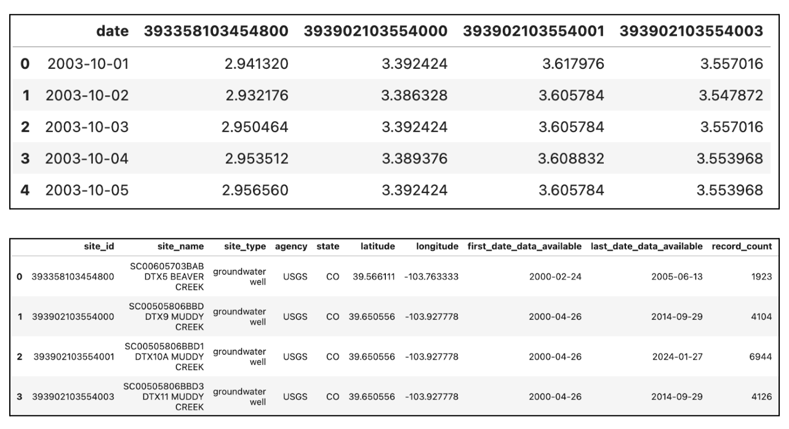

# Summary

The field of hydrologic modeling, or modeling of the terrestrial hydrologic cycle, is very data intensive. Models require many inputs to define topography, geology and atmospheric conditions. Additionally, in situ observations such as streamflow rate and depth to groundwater, can be used to evaluate model outputs and calibrate input parameters. There are many public organizations and research groups in the United States which produce and make freely available parts of this required data. However, the data have a wide range of spatiotemporal resolutions, file types, and methods of access. This makes finding and accessing all the data required for analysis a very time-consuming part of most hydrologic studies. The `hf_hydrodata` package is designed to simplify this data acquisition process by providing access to a broad array of variables, all of which have been pre-processed for consistency. 


# Statement of need

`hf_hydrodata` is a Python package that provides a streamlined, uniform syntax for accessing hydrologic data. Spanning the Continental United States, `hf_hydrodata` serves both gridded data and site-level point observations from the HydroData catalog. The package allows users to add filters to obtain data for only certain geographic areas and/or time periods of interest. This package was developed with hydrologists in mind, to facilitate the collection of domain-specific model inputs and validation data.

This package includes three main types of data. First we provide access to point observations that are compiled from public sources such as the United States. Sources include the Geological Survey (USGS), the Snow Telemetry Network (SNOTEL), Soil Climate Analysis Network (SCAN), AmeriFlux, and the National Oceanic and Atmospheric Administration (NOAA).  All point observation data are continuously updated to the HydroData Database and are pre-processed for consistency. 

We also provide access to a national geofabric of hydrologically processed topography, land cover and hydrogeology land cover datasets that were developed from the national ParFlow model (i.e. the ParFlow CONUS model, e.g. @doi:10.1126/science.aaf7891; @gmd-14-7223-2021; @YANG2023130294). Simulation outputs generated from the first ([ParFlow CONUS1.0](https://hydroframe.org/parflow-conus1)) and second ([ParFlow CONUS2.0](https://hydroframe.org/parflow-conus2)) generation of the ParFlow CONUS model are also available through this interface. 

The HydroData catalog also contains atmospheric forcing datasets that can be used to drive hydrologic models. These large gridded datasets can be difficult to download and use in their entirety. Our interface makes it possible to easily subset just the forcings needed for a local simulation without ever downloading the entire dataset. 

The aim of the `hf_hydrodata` package is to provide a "one-stop shop" for all of a hydrologists' data needs and to eliminate the burden of each researcher needing to learn multiple syntaxes in order to obtain the data relevant for their study area. It also aims to facilitate the sharing of open-source hydrologic data across research groups. `hf_hydrodata` requires a simple yet flexible set of parameters to be able to include a new offering.This keeps the barrier to entry low for members of the hydrologic community to add additional data sources to the package and keeps `hf_hydrodata` relevant as new datasets are created.


# Functionality

Complete documentation of the `hf_hydrodata` package including available datasets, example workflows, and the full API reference is available on [Read the Docs](https://hf-hydrodata.readthedocs.io/).

The `hf_hydrodata` API contains distinct modules for accessing gridded data and site-level point observations. The output data structure is designed to align with the data type: gridded data gets returned as a NumPy array [@NumPy] while point data gets returned in a pandas DataFrame [@pandas] (to connect site identifiers to time series in a straightforward manner). However the API is structured to take in compatible input parameters (where applicable), to make the data querying process as seamless as possible across the different data types. 

For example, if a user wanted to obtain gridded ParFlow CONUS1 daily simulated snow water equivalent data for the latitude/longitude bounding box of [38.749, -106.207, 41.485, -100.695] for October 1, 2003 - May 1, 2004, they would use the following syntax to get relevant data and metadata.

```python
import hf_hydrodata

gridded_parameters = {'dataset': 'conus1_baseline_mod', 
                      'variable': 'water_table_depth',
                      'temporal_resolution': 'daily',
                      'aggregation': 'mean',
                      'grid': 'conus1',
                      'latlng_bounds': [38.749, -106.207, 41.485, -100.695],
                      'start_time': '2003-10-01', 'end_time': '2004-05-01'
                      }

gridded_data = hf_hydrodata.get_gridded_data(gridded_parameters)
gridded_metadata = hf_hydrodata.get_catalog_entry(gridded_parameters)
```

If they also wanted to query observational water table depth data from USGS wells for the same geography and time period, they would use the following syntax. A subset of each of the output DataFrames produced is shown in \autoref{fig:point_example}.

```python
import hf_hydrodata

point_parameters = {'dataset': 'usgs_nwis', 
                   	'variable': 'water_table_depth',
                    'temporal_resolution': 'daily',
                    'aggregation': 'mean',
                    'latitude_range': (38.749, 41.485), 
                    'longitude_range': (-106.207, -100.695),
                    'date_start': '2003-10-01', 'date_end': '2004-05-01'
                    }

point_data = hf_hydrodata.get_point_data(point_parameters)
point_metadata = hf_hydrodata.get_point_metadata(point_parameters)
```



This streamlined syntax showcases the advantage of the `hf_hydrodata` package, to allow users to access a wide variety of hydrologic data from a simple Python interface.


# Acknowledgements

This research has been supported by the U.S. Department of Energy Office of Science (DE-AC02-05CH11231) and the US National Science Foundation Office of Advanced Cyberinfrastructure (OAC- 2054506 and OAC-1835855).

# References